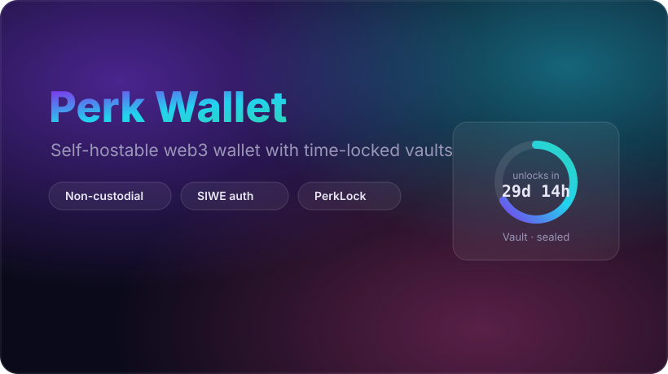

<p align="center">
  
</p>

<h1 align="center">Perk Wallet</h1>

<p align="center">
  <strong>An open-source, fully web3 crypto wallet platform with built-in time-locked asset vaults.</strong><br/>
  Create non-custodial wallets, build your on-chain profile, and lock keys, addresses & secrets until a future date — powered by drand timelock encryption.
</p>

<p align="center">
  
  
  
  
  
</p>

<p align="center">
  
</p>

---

## What is Perk Wallet?

**Perk Wallet** is a self-hostable, open-source web3 wallet you can deploy on your own host + domain to onboard real users. It pairs a non-custodial Ethereum wallet experience with **PerkLock** — an exclusive time-lock vault engine inspired by [drand/timevault](https://github.com/drand/timevault), rebuilt from scratch and extended with pro features.

With PerkLock, users can encrypt a private key, seed phrase, wallet address note, or any secret so that it is **mathematically impossible to decrypt until a time they choose**. No server holds the key — decryption is gated by the [drand](https://drand.love) distributed randomness beacon.

## Highlights

- 🔐 **Non-custodial wallets** — BIP-39 mnemonic + HD key derivation, generated client-side. Keys never leave the browser.
- ⏳ **PerkLock time-lock vaults** — lock keys, addresses or secrets until an exact future moment using drand timelock encryption (`tlock`).
- 🚀 **PerkLock Pro features** — recurring unlocks, multi-recipient locks, dead-man's-switch heartbeats, partial/staged unlock schedules, and shareable lock links (see [docs/timelock.md](docs/timelock.md)).
- 🧑‍🚀 **User profiles** — on wallet creation users pick a unique `@username`, display name, bio, avatar and social links — all editable.
- 🎨 **Creative UI** — animated glassmorphism, gradient aurora background, live countdown rings and micro-interactions.
- 🌐 **Fully web3** — connect MetaMask / injected wallets, read balances & ENS, sign-in-with-Ethereum auth.
- 📦 **Self-host ready** — one `docker compose up` to run the whole platform behind your domain.
- 📚 **Documented** — installation, deployment, architecture and API docs for your GitHub visitors.

## Architecture at a glance

```
perk-wallet/
├── frontend/            # React + Vite + TypeScript SPA (the wallet UI)
├── server/              # Express + TypeScript API (profiles, usernames, vault storage, SIWE auth)
├── packages/perklock/   # Reusable time-lock encryption library (drand tlock wrapper)
├── deploy/              # Docker, nginx and production config
├── docs/                # Full project documentation
└── docker-compose.yml   # One-command full-stack deployment
```

See [docs/architecture.md](docs/architecture.md) for the full diagram and data flow.

## Quickstart (local dev)

> Prerequisites: **Node 18+** and **npm 9+** (or Docker).

```bash
# 1. Clone
git clone https://github.com/<your-org>/perk-wallet.git
cd perk-wallet

# 2. Install all workspaces
npm install

# 3. Configure environment
cp .env.example .env

# 4. Run the time-lock library build, the API and the frontend together
npm run dev
```

- Frontend: http://localhost:5173
- API: http://localhost:8080

## Deploy to your host + domain

The fastest path is Docker Compose with the bundled nginx reverse proxy and automatic HTTPS via Let's Encrypt:

```bash
cp .env.example .env       # set PUBLIC_DOMAIN, LETSENCRYPT_EMAIL, etc.
docker compose up -d --build
```

Point your domain's A record at the server and Perk Wallet is live at `https://your-domain`. Full walkthrough (DigitalOcean, Hetzner, AWS, bare metal) in [docs/deployment.md](docs/deployment.md).

## How PerkLock works (the time-lock feature)

1. The user chooses **what** to lock (key / seed / address / message) and **when** it should unlock.
2. Perk Wallet asks the drand network for the *round number* that will be reached at the target time.
3. The secret is encrypted to that future round with `tlock` — the decryption key literally does not exist yet.
4. When drand reaches that round, it publishes the signature that anyone can use to decrypt. Not a second before.

This means **even the server operator cannot open a vault early**. See [docs/timelock.md](docs/timelock.md) for the cryptography, the pro features, and ciphertext compatibility with the Go `tlock` library.

## Documentation

| Doc | Description |
|-----|-------------|
| [Installation](docs/installation.md) | Local setup and workspace layout |
| [Deployment](docs/deployment.md) | Run on your host + domain with Docker + HTTPS |
| [Architecture](docs/architecture.md) | System design and data flow |
| [PerkLock / Time-lock](docs/timelock.md) | The vault engine, crypto & pro features |
| [API Reference](docs/api.md) | REST endpoints for profiles & vaults |
| [Configuration](docs/configuration.md) | All environment variables |
| [Security](docs/security.md) | Threat model & best practices |
| [FAQ](docs/faq.md) | Common questions |

## Security & disclaimer

Perk Wallet is non-custodial: **you and your users are responsible for backing up seed phrases.** PerkLock provides strong time-lock guarantees but you should read [docs/security.md](docs/security.md) and audit the code before handling real funds. This software is provided "as is" under the MIT license.

## Contributing

PRs are welcome! Read [CONTRIBUTING.md](CONTRIBUTING.md) and our [Code of Conduct](CODE_OF_CONDUCT.md). Report vulnerabilities via [SECURITY.md](SECURITY.md).

## License

[MIT](LICENSE) © Perk Wallet contributors. Inspired by the excellent [drand/timevault](https://github.com/drand/timevault); PerkLock is an independent implementation.
