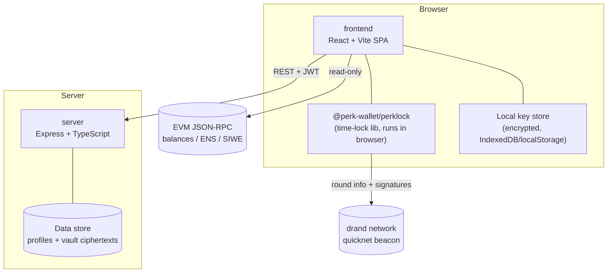

# Architecture

Perk Wallet is a small monorepo with a clean separation between the **client-side wallet** (where all secrets live) and a **thin backend** (which only ever sees public data and ciphertext).

## Components



## Responsibilities

### frontend (`/frontend`)
- Generates non-custodial wallets (BIP-39 mnemonic → HD account) entirely in the browser.
- Encrypts the seed at rest with a user passphrase before storing locally.
- Drives the PerkLock UI: create vaults, show live countdowns, unlock.
- Manages profile UI (username, display name, bio, avatar, socials).
- Handles Sign-In-With-Ethereum to authenticate to the API.

### server (`/server`)
- Stateless Express API.
- Enforces **unique usernames** and stores profile metadata.
- Stores vault **ciphertext + metadata** (never plaintext, never private keys).
- Issues short-lived JWTs after verifying SIWE signatures.
- Pluggable data store (JSON file by default; swap for Postgres/SQLite).

### packages/perklock (`/packages/perklock`)
- Framework-agnostic TypeScript library wrapping `tlock`/drand.
- Used by the frontend in the browser; can also be used server-side or in a CLI.

## Data flow: creating a time-lock vault

1. User enters a secret and an unlock time in the UI.
2. Frontend calls `PerkLock.lock({ payload, unlockAt })`.
3. PerkLock fetches drand chain info, computes the target round, and timelock-encrypts the payload.
4. Frontend `POST`s the ciphertext + metadata to `/api/vaults` (authenticated).
5. Server stores it and returns a vault id.
6. Anytime later the UI shows a countdown; after unlock time, the user clicks **Unlock** and PerkLock decrypts locally.

## Data store schema (default JSON / SQLite)

```ts
Profile {
  address: string        // checksummed EVM address (primary key)
  username: string       // unique, lowercase, [a-z0-9_]{3,20}
  displayName: string
  bio?: string
  avatarUrl?: string
  socials?: { x?: string; github?: string; website?: string }
  createdAt: string
  updatedAt: string
}

Vault {
  id: string             // uuid
  ownerAddress: string   // FK -> Profile.address
  label: string
  ciphertext: string     // age-armored tlock ciphertext
  unlockRound: number
  unlockAt: string       // ISO timestamp (informational)
  kind: "key" | "mnemonic" | "address" | "message"
  createdAt: string
}
```

## Why so little on the server?

By keeping the server custody-free, an attacker who fully compromises it still cannot steal funds or open vaults early — the worst case is access to ciphertext that is useless until its drand round and access to public profile data. This is the core security property of Perk Wallet.
