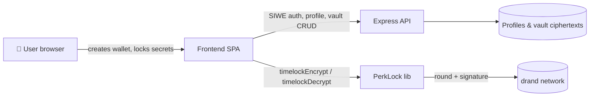

# Perk Wallet Documentation

Welcome to the Perk Wallet docs. Perk Wallet is an open-source, fully web3 crypto wallet platform with built-in **PerkLock** time-locked asset vaults.

## Contents

- [Installation](installation.md) — get running locally
- [Configuration](configuration.md) — environment variables
- [Architecture](architecture.md) — how the pieces fit together
- [PerkLock / Time-lock](timelock.md) — the vault engine, cryptography & pro features
- [API Reference](api.md) — REST endpoints
- [Deployment](deployment.md) — run on your host + domain
- [Security](security.md) — threat model & hardening
- [FAQ](faq.md)

## The 60-second tour

Perk Wallet has three parts:

1. **frontend** — a React SPA where users create non-custodial wallets, set up their `@username` profile, and lock secrets with PerkLock.
2. **server** — an Express API that stores profiles, enforces unique usernames, and persists time-lock vault ciphertexts.
3. **packages/perklock** — the reusable library that performs drand-powered time-lock encryption/decryption.

Keys and seed phrases are generated and held **client-side**. The server only ever sees ciphertext.
