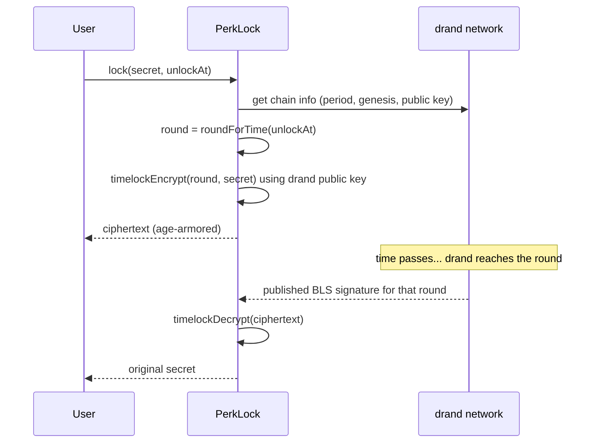

# PerkLock — the time-lock vault engine

PerkLock is Perk Wallet's exclusive time-lock module. It lets users encrypt a secret — a private key, seed phrase, wallet address note, or any message — so that it can only be decrypted **after an exact moment in the future they choose**. Not the server, not the user, nobody can open it early.

It is inspired by [drand/timevault](https://github.com/drand/timevault) but is an independent implementation living in [`packages/perklock`](../packages/perklock), with an extended **Pro** feature set.

## How time-lock encryption works

PerkLock uses **`tlock`** (timelock encryption) over the [drand](https://drand.love) distributed randomness beacon (the "quicknet" network that supports unchained, timelock-compatible signatures).



The magic: the decryption key is the drand signature for a **future round**. That signature does not exist until the network reaches it. Because drand is a threshold network run by the League of Entropy, no single party can produce it early.

Ciphertexts are produced in the **age armor** format and are compatible with the Go [`tlock`](https://github.com/drand/tlock) CLI — so a vault locked in Perk Wallet can also be opened with standard tooling once unlocked.

## Core API

```ts
import { PerkLock } from "@perk-wallet/perklock"

const lock = await PerkLock.connect() // connects to drand mainnet/quicknet

// Lock a secret until a date
const vault = await lock.lock({
  payload: "my-super-secret-seed-phrase",
  unlockAt: new Date("2030-01-01T00:00:00Z"),
  label: "Cold wallet seed",
})

console.log(vault.ciphertext)   // safe to store anywhere
console.log(vault.unlockRound)  // drand round the vault unlocks at

// Later, after the unlock time:
const secret = await lock.unlock(vault.ciphertext)
```

You can also lock for a **duration** instead of an absolute date:

```ts
await lock.lockFor({ payload: secret, duration: "30d" }) // 30 days from now
```

## Pro features (beyond timevault)

PerkLock extends the basic timevault concept with features designed for real wallet users:

| Feature | Description |
|---------|-------------|
| ⏱️ **Duration or absolute unlock** | Lock until a precise date *or* `"7d"`, `"12h"`, `"90m"`, `"1y"` style durations. |
| 🪜 **Staged / partial unlocks** | Split a secret with Shamir secret sharing so shares unlock at different times (e.g. 50% in 30 days, 100% in 90 days). |
| 👥 **Multi-recipient locks** | Lock the same secret for several wallet addresses; each can decrypt after unlock. |
| 💀 **Dead-man's-switch heartbeat** | A vault auto-arms its unlock if the owner stops "checking in" within an interval — great for inheritance of keys. |
| 🔗 **Shareable lock links** | Export a vault as a self-contained link/QR that anyone can open *after* unlock time. |
| 🧩 **Re-locking** | Decrypt and immediately re-lock with a new schedule in one step. |
| 🔎 **Verifiable metadata** | Each vault embeds tamper-evident metadata (label, created-at, unlock round) checked on decrypt. |
| 📦 **Wallet-native payloads** | First-class helpers to lock a private key, mnemonic, keystore JSON, or address watchlist. |

See the [PerkLock package README](../packages/perklock/README.md) for the full API including `lockShares`, `lockForRecipients`, `arm`, `heartbeat`, and `toShareLink`.

## Choosing the network

Time-lock requires the drand **quicknet** beacon (unchained, G1 sigs). PerkLock defaults to it via `PerkLock.connect()`. For tests you can point at testnet:

```ts
const lock = await PerkLock.connect({ network: "testnet" })
```

## Security notes

- The secret is encrypted **client-side**. The server only stores ciphertext + public metadata.
- Losing the ciphertext = losing the secret. Encourage users to download/back up their vault file.
- Time-lock guarantees the secret cannot be read *early*; it does **not** guarantee availability if drand disappears. drand has run continuously since 2020 with multiple independent operators, but for very long locks consider keeping your own copy of the chain public key.

See [security.md](security.md) for the complete threat model.
